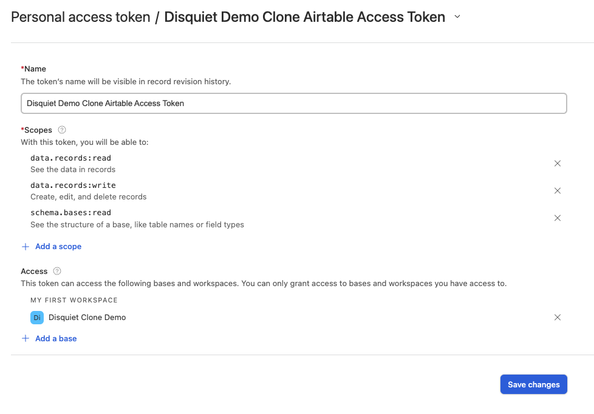
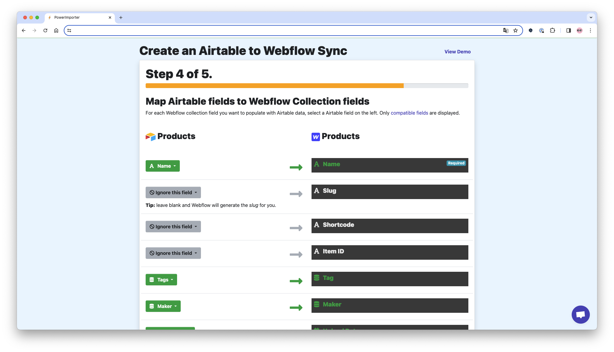

# Welcome to webflow 👋

> Creating a site using webflow. The main purpose of this project is to understand what CMS(Content Management System) is. As webflow is a no-code tool, there will be no codes for this project.

## Install

### Chrome Extension

- Flowbase Chrome Extension
- Finsweet Extension for Webflow
- HeadingsMap

## Component Sites

- [Webflow Library (Free)](https://webflow.com/libraries)
- [Relume Webflow Library (Partially Free)](https://www.relume.io/components)

## Template Sites

- [Webflow Template (Provides Styleguide)](https://webflow.com/templates)
- [Finsweet Template (Recommended ⭐️)](https://finsweet.com/client-first)
- [Finsweet Styleguide (Recommended ⭐️)](https://webflow.com/made-in-webflow/website/client-first-cloneable?gspk=NDg2ODEzOQ&gsxid=Ow5FaqmKxv8L)

## Materials

- [Airtable Database for cloning](https://airtable.com/appI45Bgq5lU3Dy3h/shrxoEpbGJDaNoV5L)

## Import Data

1. Login [PowerImporter](https://www.powerimporter.com/)
2. Choose 'Airtable to Webflow sync'
3. Choose 'Login to Webflow'
4. Get Airtable API Key from Airtable Account Setting
5. Go on.. (Don't map Slug, Item ID, Shortcode)
6. Publish Webflow Site
7. Test & Review
8. Sync

## Result

- https://disquiet-clone-demo-1fff55.webflow.io/

## Things I haven't tried

- [Memberstack for Authentication](https://www.memberstack.com/)
- [Finsweet Attribute for CMS](https://finsweet.com/attributes)
  - CMS Nesting
  - CMS Sort
  - CMS Slider
  - CMS Filter
- [Disqus for comments](https://disqus.com)
- Airtable's Plugin for sync (CMS > Airtable)
  - Noble Airtable (Item ID, Shortcode)
- [Tally Form for uploading files](https://tally.so/)

## Author

👤 **Kevin Ahn**

- Github: [@seung-seop-ahn](https://github.com/seung-seop-ahn)
